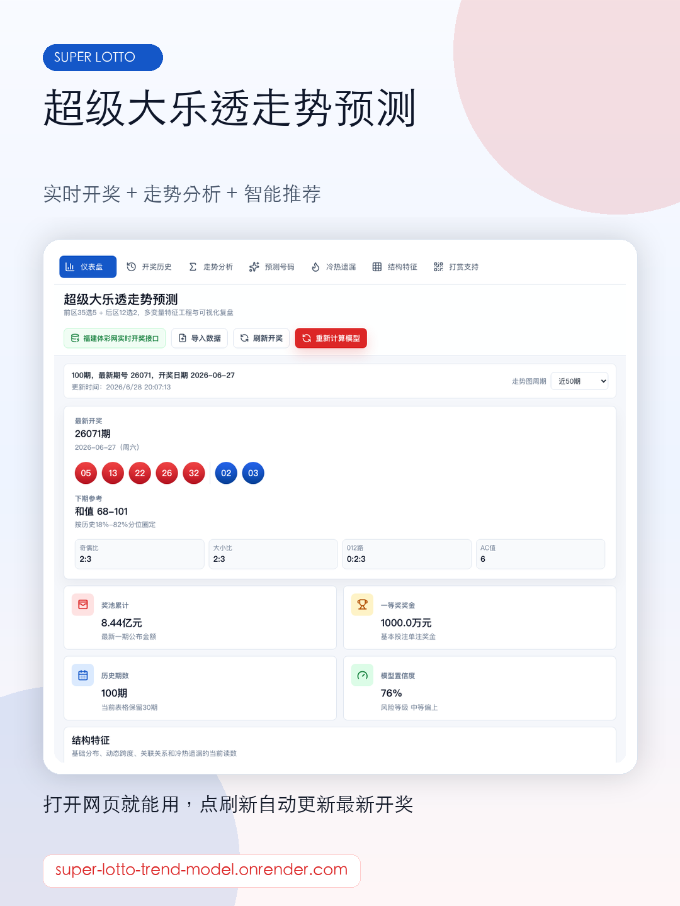
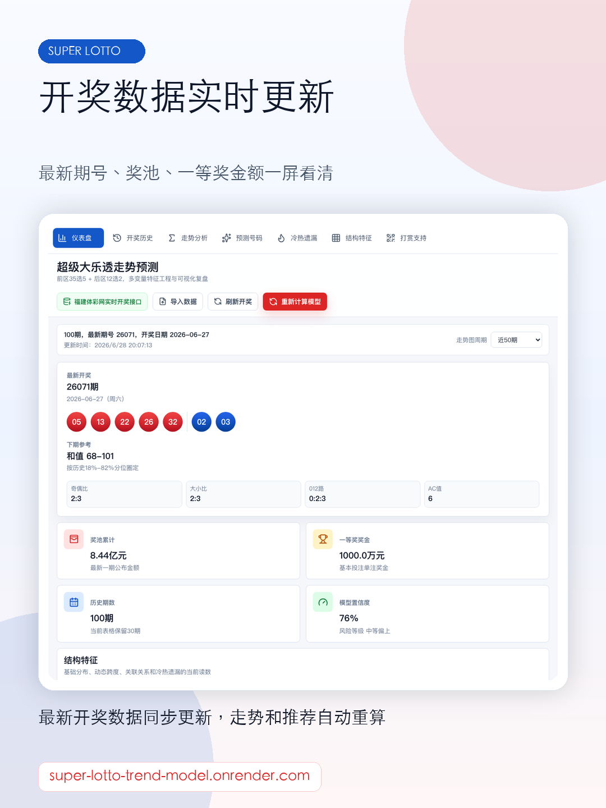
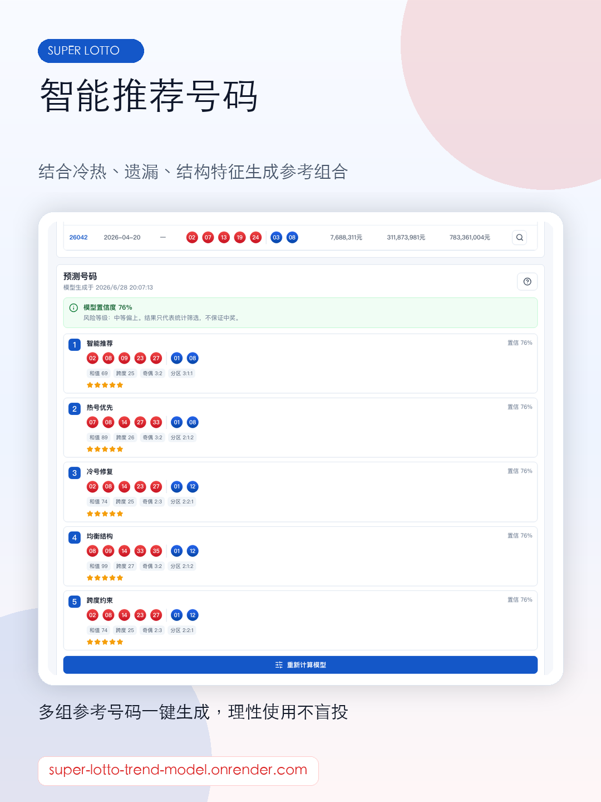
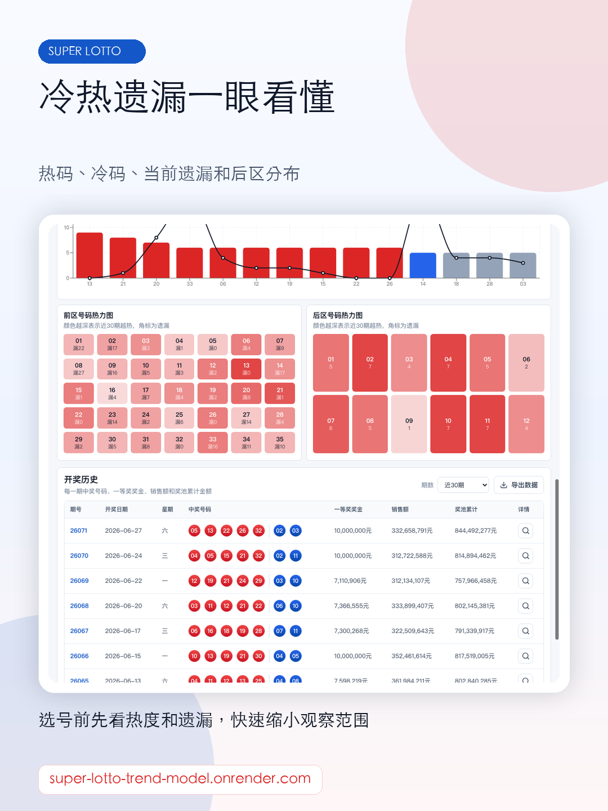

# 超级大乐透走势预测模型

[](https://render.com/deploy?repo=https://github.com/leoyoyofiona/super-lotto-trend-model)

中国体育彩票数字型彩种开奖走势分析与预测看板。支持超级大乐透、排列3、排列5和7星彩，页面包含彩种切换、开奖数据更新、走势图、冷热遗漏、结构特征、预测号码、开奖历史与命中率回测。

免责声明：本项目仅供爱好者进行预测分析和统计分析，不作为博彩投注的参考依据。

线上地址：[https://super-lotto-trend-model.onrender.com](https://super-lotto-trend-model.onrender.com)

## 宣传图预览

小红书配图和文案在 [`promo`](promo) 目录。

<p>
  
  
  
  
  
</p>

## 本地运行

```bash
npm install
npm run dev
```

## 生产运行

```bash
npm run build
PORT=4174 npm run start
```

生产服务由 `server/index.mjs` 托管 `dist`，并代理 `/fjtc-lottery/lottery` 到福建体彩网开奖接口。部署后页面点击“刷新开奖”会通过同一个代理获取最新开奖数据。

访问统计接口为 `/api/visits`。线上优先使用 `VISIT_DATABASE_URL` 指向的 PostgreSQL 持久化保存；没有数据库时才退回 `.data/visit-counter.json` 本地文件。Render 免费实例的本地文件在重启、休眠唤醒或重新部署后可能丢失，所以线上必须绑定数据库才能保证累计数据不清零。统计数据会写入 `super_lotto_visit_counter` 和 `super_lotto_visit_visitors` 两张独立表；如果 Render 账户已有免费数据库，可以复用同一个 Postgres。

如果需要把计数器上线前的历史访问量补入页面，可在 Render 环境变量中设置：

- `VISIT_BASELINE_TOTAL`：历史总访问次数
- `VISIT_BASELINE_UNIQUE`：历史唯一来访人数
- `VISIT_BASELINE_STARTED_AT`：历史统计起点，默认 `2026-06-28T10:11:49Z`

页面显示值 = 历史基准值 + 新计数器上线后的增量值。

## Render 部署

项目根目录已经包含 `render.yaml`，可作为 Render Blueprint 或 Web Service 配置使用：

- Build Command: `npm ci --include=dev --ignore-scripts && npm run build`
- Start Command: `npm run start`
- Node: `22.12.0`

如果通过 Render Dashboard 手动创建服务，选择 Node Web Service，填入上面的构建和启动命令即可。

## 打赏二维码

页面会读取以下两个文件：

- `public/donate/alipay-qr.jpg`
- `public/donate/wechat-qr.jpg`

<p>
  
  
</p>

替换收款码时，保持文件名不变即可；也可以换成 PNG/SVG，但要同步修改 `src/App.tsx` 里的图片路径。
